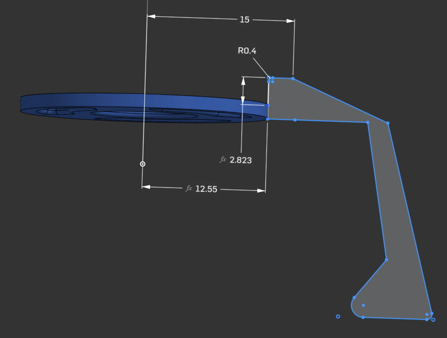

**NOTE**: Before you begin, you should <a href="https://www.onshape.com/en/sign-up" target="_blank" rel="noopener noreferrer">create an OnShape account</a>

1. Open the <a href="https://cad.onshape.com/documents/0ee18ad07fa25b171294ff0e/w/708a71545366064b46ca57ed/e/fc8b0cdbc68c19ca517e516e?renderMode=0&uiState=696194021a30e17eb0d6b7b4" target="_blank" rel="noopener noreferrer">openThrow onShape</a>, and head to the `Shell starter` tab.
2. Double-Click on the feature on the left marked `profile`
3. Edit as desired. The necessary dimensions are already set, the rest is up to the designer.

