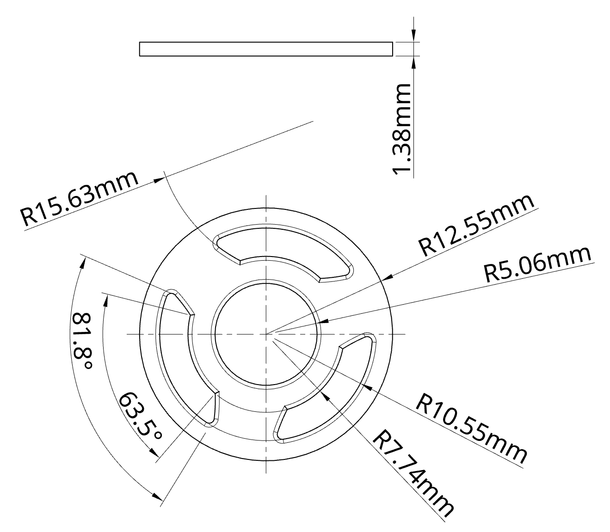

The interconnect is the part at the base of the response recess that allows the connecting with the stem system.

### Critical Dimensions
- For creating a shell, it's possible to start with a radius 12.55mm circle.

## Where To Download.

- All parts available on the <a href="https://cad.onshape.com/documents/0ee18ad07fa25b171294ff0e/w/708a71545366064b46ca57ed/e/fc8b0cdbc68c19ca517e516e?renderMode=0&uiState=696194021a30e17eb0d6b7b4" target="_blank" rel="noopener noreferrer">openThrow onShape</a>
